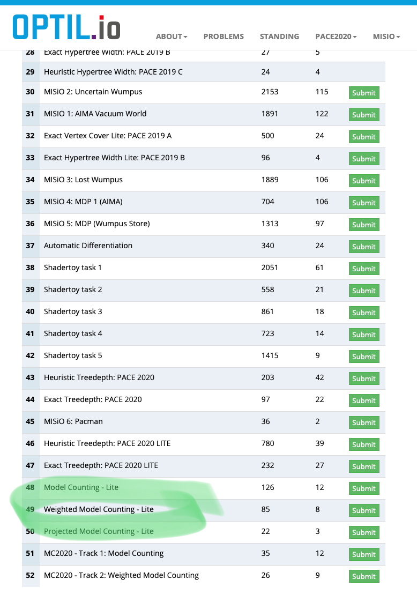
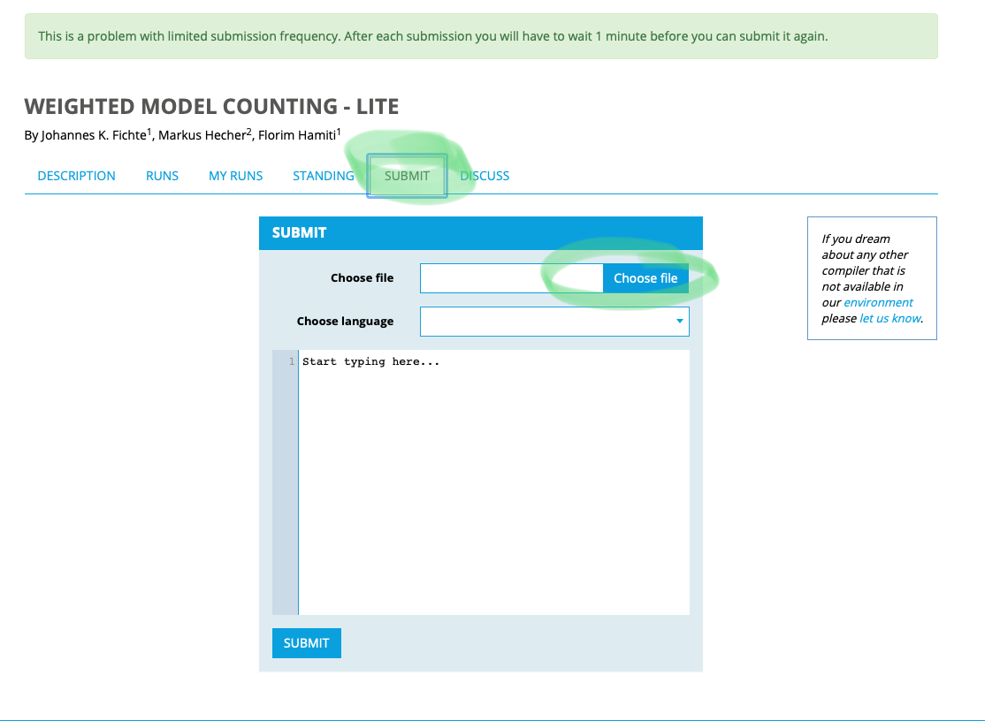
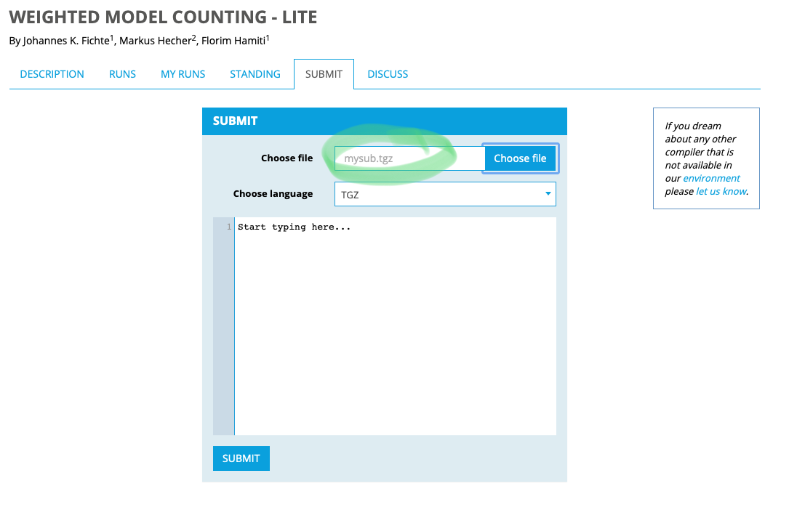
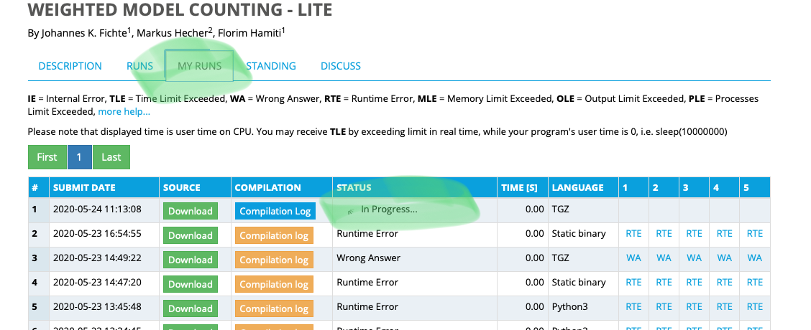
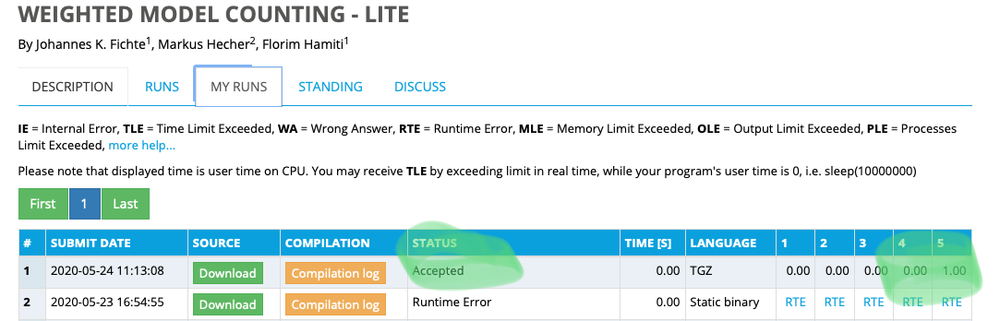

---
---
# Details on Optil Submission

## Sample File
- We provide a sample package [mysub.tgz](../assets/files/2020/mysub.tgz) for the submission.
- The file contains a startscript (in bash) mysub, which calls two subscripts (foo and foo2) from the subfolder bin/. The output of foo is linked to the input of foo2 by a pipe. This should provide you with a sample for your standard usecase.
- The script only outputs a line that is only solution for the last testcase.  
- We suggest that you try with the Lite Tracks, which are designed to upload only instances for format testing.
- Environment: Kernel 4.4, for more details we refer to the [Optil Environment Description](https://www.optil.io/optilion/environment).

### Strict Requirements
- Your mysubmission.tgz file must contain the file mysubmission at the root level.
```bash
#mysubmission$ ls
               ...
               mysubmission
               ... 
```
- The file mysubmission has to be world executable (755 or 777).
- If you use a bash script, then set the shebang and pipe behavior properly.
```bash
#mysubmission$ head mysubmission -n2
#!/bin/sh
set -e
```
- Create the submission file from your submission folder.
```bash
#mysubmission$ tar czf ../mysubmission.tgz *
```
- Submit the file mysubmission.tgz as tgz filetype with optil.


## Submission Process
### Login


### Select Problems


### For example, select the Weighted Model Counting Lite Track


### Select Submit and Upload our Sample File


### Submit a solution (select tgz)


### Optil will redirect to My Runs and initialize the run


### After the run optil should output 1.00 for the last instance


- Solved instances are marked by 1.00 unsolved by 0.00

---