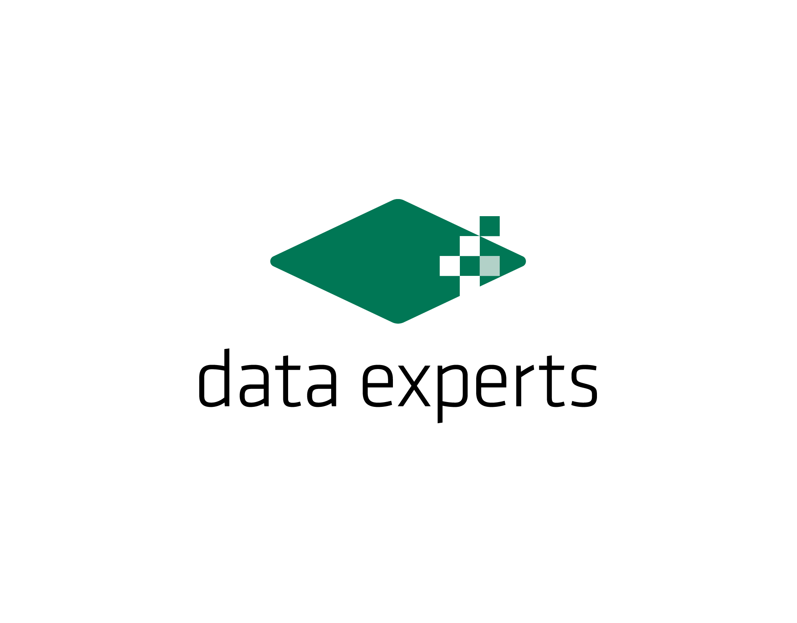

---
---

<!-- 

2023 Competition is in the evaluation phase. Public instances are available.
Do not forget to register your intent to submit in the <a href="https://tinyurl.com/bdf93keu">Google Form</a>.

  -->

<!--
#
# Updated results are available [Download Updated Slides](assets/files/2020/MC2020_awards.pdf).

For details on the workshop its presentations, slides, and recordings we refer to the [Programm](2020/mcw_program).

Updated results of the competition will be out soon.
-->

[//]: # (# Model Counting &#40;MC-2022&#41;)

[//]: # ()

[//]: # (The model counting competition instances are online for Track 1-4 and submission is closed. We are currently evaluating StarExec. )

[//]: # ()

[//]: # (Since StarExec experiences high load, evaluation might take a couple of days longer )

[//]: # ()

[//]: # (See updates: [STATUS and NEWS]&#40;news&#41;. [Download Public Instances]&#40;https://cloudstore.zih.tu-dresden.de/index.php/s/9AETnoL86ND5W8t&#41; [StarExec System]&#40;https://www.starexec.org/starexec/secure/explore/spaces.jsp?id=520765&#41;)

# Competition

The _5th Competition on Model Counting (MC 2024)_ is a competition to deepen the relationship between latest theoretical
and practical development on the various model counting problems and their practical applications. It targets the
problem of counting the number of models of a Boolean formula.

Further details on the competition can be found at: [Competition 2024](2024/mc_description)
  

# Workshop on Counting and Sampling

The _International Workshop on Model Counting and Sampling_ aims to provide a venue for researchers working on
model counting such as model counting (mc), weighted model counting/sum of products (wmc),
projected model counting (pmc) as well as sampling models within the realm but not restricting to
Boolean satisfiability (SAT),
satisfiability modulo theories (SMT), Answer set programming (ASP), and constraint programming (CP).
It encourages to meet, communicate, and discuss the latest theoretical and practical results,
in particular results on novel solvers, related solver technologies, new theoretical advances,
practical academic and industrial applications as well as the linking theory and practice.
The workshop is also the place for developers of model counters and samplers to present their programs
and the presentation of detailed results on the model counting competition.

Further details on the competition can be found at: [Workshop on Counting and Sampling 2024](2024/mcw_description)

<!--
# Program
The program is available at [Workshop 2021 Program](2021/mcw_program).

# Competition Results
The competition results will be presented on Friday, July 9th at the SAT conference during the Competitive events session (17:40-18:30). 
See: [SAT program](https://www.iiia.csic.es/sat2021/program/#Friday9).
-->

<!--
# Submissions
For competition and workshop submissions see [Dates and Submission](2021/dates).
-->

# Sponsors

On behalf of the Program Committee of MC 2024, we invite you to participate in the sponsoring of metals and travel
support for the winners.

<!--
[data-experts](https://data-experts.de) already announced sponsoring for MC 2020.

-->
---
